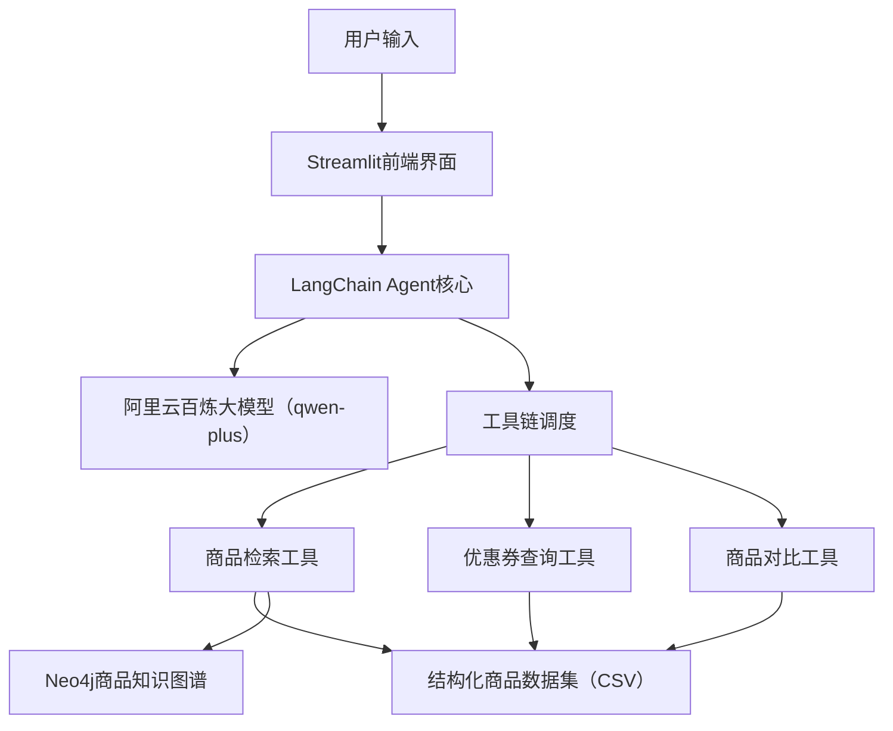

# 电商智能导购Agent
🎯 基于阿里云百炼+LangChain+Neo4j构建的多轮会话导购系统，覆盖「需求挖掘→商品推荐→对比→优惠匹配→下单引导」全流程，专为AI产品经理作品集设计，突出流程闭环与数据驱动能力。

## 项目亮点
### 1. 核心功能闭环
| 功能模块 | 核心能力 | 场景示例 |
|----------|----------|----------|
| 需求澄清 | 模糊需求自动追问（预算/肤质/使用场景） | 输入「买口红」→ 追问「预算范围+唇部状态」 |
| 精准推荐 | 基于结构化数据的商品检索 | 输入「300元内干燥浅唇口红」→ 推荐匹配商品 |
| 商品对比 | 核心参数可视化对比 | 输入「口红K和L哪个好」→ 生成优缺点对比表 |
| 优惠匹配 | 自动匹配优惠券+计算折后价 | 推荐商品后自动显示「满200减30」及折后价 |
| 下单引导 | 全流程导购转化 | 用户确认购买后→引导加购→结算→锁定优惠 |

### 2. 技术架构

- **大模型**：阿里云百炼（qwen-plus）- 负责多轮会话理解与流程调度
- **Agent框架**：LangChain - 管理工具调用、会话记忆与流程逻辑
- **数据存储**：CSV（结构化商品数据）+ Neo4j（商品知识图谱，可选）
- **前端展示**：Streamlit - 轻量化可视化对话界面，支持快速演示
- **工具链**：商品检索、优惠券查询、商品对比三大核心工具

### 3. 产品优势
- 🚀 **流程闭环**：覆盖导购全链路，模拟真实电商导购沟通场景
- 📊 **数据可控**：所有商品/优惠数据来自本地CSV，无模型幻觉，可复现
- 🎨 **交互友好**：口语化回复+emoji增强，降低用户沟通成本
- 🔌 **低代码扩展**：新增品类仅需补充CSV数据，无需大幅修改代码
- 📱 **多场景适配**：支持口红、粉底液、面霜等多美妆品类导购

## 快速启动
### 1. 环境准备
| 依赖项 | 版本要求 | 说明 |
|--------|----------|------|
| 操作系统 | Windows10/11 | 兼容主流Windows系统 |
| Python | 3.9+ | 推荐3.9版本，兼容性最佳 |
| 依赖管理 | Anaconda | 快速创建隔离环境 |
| 可选依赖 | Neo4j 5.x | 用于商品知识图谱功能 |
| 必要密钥 | 阿里云百炼API Key | 免费额度可满足测试需求 |

### 2. 部署步骤
#### 步骤1：克隆仓库
```bash
git clone https://github.com/MagicYao/ecommerce_agent.git
cd ecommerce_agent
```

#### 步骤2：创建并激活conda环境
```bash
# 创建专属环境
conda create -n ecommerce_agent python=3.9
# 激活环境
conda activate ecommerce_agent
# 安装依赖包
pip install -r requirements.txt
```

#### 步骤3：配置API Key
1. 登录阿里云百炼控制台：https://dashscope.console.aliyun.com/
2. 进入「API-KEY管理」获取API Key
3. 配置系统环境变量（Windows）：
   - 右键「此电脑」→「属性」→「高级系统设置」→「环境变量」
   - 新建「系统变量」：变量名`DASHSCOPE_API_KEY`，值为你的API Key
   - 重启终端/VSCode使配置生效

#### 步骤4：初始化数据（无需手动操作）
- 商品数据已内置在 `data/product_data.csv`，包含12款美妆商品（口红3款+粉底液5款+面霜4款）
- （可选）构建Neo4j知识图谱：
  ```bash
  python build_kg.py
  ```
  需先安装Neo4j并配置 `config.py` 中的Neo4j连接信息（默认本地地址：`bolt://localhost:7687`）

#### 步骤5：运行Demo
```bash
# 方式1：终端交互测试（快速验证功能）
python agent.py

# 方式2：Streamlit可视化界面（推荐演示）
streamlit run app.py
```
- 可视化界面访问地址：http://localhost:8501（启动后自动打开）

### 3. 测试场景示例
#### 场景1：模糊需求澄清与精准推荐
```
用户：买口红
小智：你的预算范围是多少呀？（如100-200元）～
还有唇部状态是干燥还是不卡纹呢？😊

用户：300以内，干燥，浅唇
小智：为你推荐以下符合需求的口红：
1. 滋润保湿口红K～原价¥199，折后¥179（满150减20元）～优势：保湿不卡纹，适合浅唇～
2. 浅唇专用口红L～原价¥259，折后¥229（满200减30元）～优势：浅唇显色自然，保湿力强～
3. 复古红口红I～原价¥289，折后¥249（满250减40元）～优势：显白不挑皮，不拔干～

🎫 可用优惠券汇总：
- 滋润保湿口红K：满150减20元，折后¥179
- 浅唇专用口红L：满200减30元，折后¥229
- 复古红口红I：满250减40元，折后¥249

看上哪一款呀？😊
```

#### 场景2：商品对比与下单引导
```
用户：口红K和L哪个好
小智：| 商品 | 价格 | 适合场景 | 优点 | 缺点 |
| --- | --- | --- | --- | --- |
| 滋润保湿口红K | ¥199 | 干燥唇部 | 保湿不卡纹，性价比高 | 色号仅3款 |
| 浅唇专用口红L | ¥259 | 浅唇/干燥唇部 | 显色自然，保湿力强 | 略沾杯 |

总结：预算有限选K，追求显色选L～需要锁定其中一款优惠吗？😊

用户：选口红L
小智：好的～浅唇专用口红L折后¥229～是否帮你锁定优惠并跳转下单呀？😊

用户：需要，加购卸妆水
小智：好的～加购搭配卸妆水后组合总价¥229+78=307元～
现在一并结算吗？帮你跳转～
```

## 数据集说明
### 商品数据格式（data/product_data.csv）
| 字段 | 说明 | 示例 |
|------|------|------|
| product_id | 商品唯一标识 | 1011 |
| name | 商品名称 | 滋润保湿口红K |
| category | 商品类目（子品类） | 美妆-口红 |
| price | 商品原价（元） | 199 |
| budget_range | 预算区间 | 100-200 |
| suitable_for | 适配场景/肤质 | 干燥唇部 |
| parameters | 核心参数 | 保湿质地，持久6小时，浅唇适配 |
| advantages | 商品优点 | 保湿不卡纹，适合浅唇 |
| disadvantages | 商品缺点 | 色号较少（3色） |
| coupon_id | 优惠券ID | C011 |
| coupon_amount | 优惠金额（元） | 20 |
| coupon_condition | 优惠券使用条件 | 满150可用 |

### 数据扩展指南
新增品类（如妆前乳、卸妆水）仅需：
1. 在 `product_data.csv` 中按上述字段添加商品数据
2. 在 `agent.py` 的 `search_products` 函数中新增子品类匹配（如“妆前乳”→“美妆-妆前乳”）
3. 无需修改核心逻辑，Agent自动适配新品类

## 技术细节
### 1. 会话记忆管理
基于LangChain的 `ConversationBufferMemory` 实现，记住用户历史输入（如预算、肤质），避免重复追问，提升对话流畅度。

### 2. 工具调用逻辑
- 触发条件：用户输入包含「推荐、对比、哪个好、优惠券」等关键词
- 调度流程：Agent解析需求→调用对应工具→整合结果→生成回复
- 容错机制：工具调用失败时返回友好提示，不中断对话流程

### 3. 防模型幻觉设计
- 数据约束：Prompt强制模型仅使用CSV中的商品信息
- 格式限制：回复模板固定，避免模型编造外部品牌/价格
- 无匹配处理：明确提示“未找到符合条件的商品”，不冗余推荐

## 扩展方向
1. 🛒 对接真实电商API（如淘宝/京东开放平台），替换模拟数据
2. 🖼️ 多模态能力：添加商品图片识别推荐（基于CLIP模型）
3. 📊 用户画像集成：基于历史购买记录优化推荐策略
4. 📱 多渠道适配：支持抖音/小红书等平台的导购话术风格
5. 🤖 智能客服集成：新增售后问题自动解答模块

## 依赖清单
核心依赖已整理至 `requirements.txt`，包含：
```
langchain==0.1.19
langchain-dashscope==0.1.8
dashscope==1.14.1
streamlit>=1.30.0
pandas>=2.1.0
numpy>=1.26.0
neo4j>=5.18.0
python-dotenv>=1.0.0
retrying>=1.3.4
```
