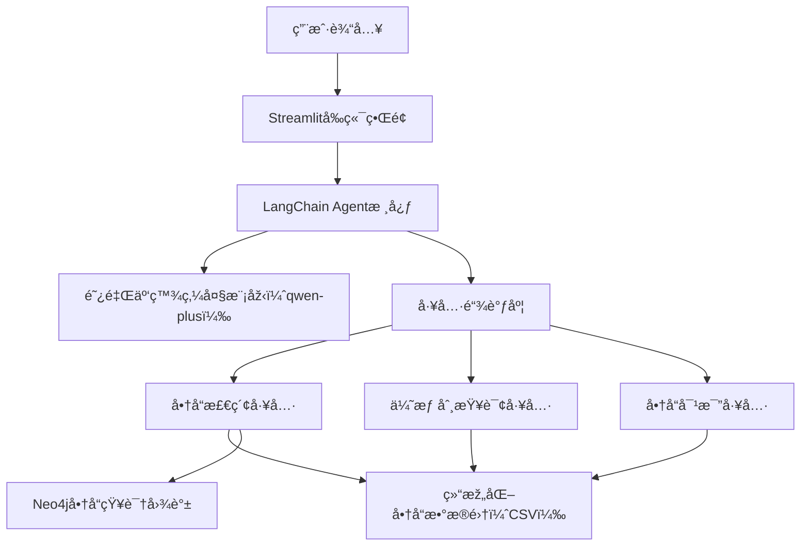

# 电商智能导购Agent
🎯 基于阿里云百炼+LangChain+Neo4j构建的多轮会è¯å¯¼è´­ç³»ç»Ÿï¼Œè¦†ç›–「需求挖掘→商å“推è→对比→优惠匹é…→下å•å¼•å¯¼ã€å…¨æµç¨‹ï¼Œä¸“为AI产å“ç»ç†ä½œå“集设计，çªå‡ºæµç¨‹é—­çŽ¯ä¸Žæ•°æ®é©±åŠ¨èƒ½åŠ›ã€‚

## 项目亮点
### 1. 核心功能闭环
| åŠŸèƒ½æ¨¡å— | 核心能力 | 场景示例 |
|----------|----------|----------|
| 需求澄清 | 模糊需求自动追问（预算/肤质/使用场景） | 输入「买å£çº¢ã€â†’ 追问「预算范围+唇部状æ€ã€ |
| 精准推è | 基于结构化数æ®çš„商å“检索 | 输入「300元内干燥浅唇å£çº¢ã€â†’ 推è匹é…å•†å“ |
| 商å“对比 | 核心å‚æ•°å¯è§†åŒ–对比 | 输入「å£çº¢Kå’ŒL哪个好ã€â†’ 生æˆä¼˜ç¼ºç‚¹å¯¹æ¯”表 |
| ä¼˜æƒ åŒ¹é… | 自动匹é…优惠券+计算折åŽä»· | 推è商å“åŽè‡ªåŠ¨æ˜¾ç¤ºã€Œæ»¡200å‡30ã€åŠæŠ˜åŽä»· |
| 下å•å¼•å¯¼ | å…¨æµç¨‹å¯¼è´­è½¬åŒ– | 用户确认购买åŽâ†’引导加购→结算→é”定优惠 |

### 2. 技术架构

- **大模型**：阿里云百炼（qwen-plus）- 负责多轮会è¯ç†è§£ä¸Žæµç¨‹è°ƒåº¦
- **Agent框架**：LangChain - 管ç†å·¥å…·è°ƒç”¨ã€ä¼šè¯è®°å¿†ä¸Žæµç¨‹é€»è¾‘
- **æ•°æ®å­˜å‚¨**：CSV（结构化商å“æ•°æ®ï¼‰+ Neo4j（商å“知识图谱，å¯é€‰ï¼‰
- **å‰ç«¯å±•ç¤º**：Streamlit - è½»é‡åŒ–å¯è§†åŒ–对è¯ç•Œé¢ï¼Œæ”¯æŒå¿«é€Ÿæ¼”示
- **工具链**：商å“检索ã€ä¼˜æƒ åˆ¸æŸ¥è¯¢ã€å•†å“对比三大核心工具

### 3. 产å“优势
- 🚀 **æµç¨‹é—­çŽ¯**：覆盖导购全链路，模拟真实电商导购沟通场景
- 📊 **æ•°æ®å¯æŽ§**：所有商å“/优惠数æ®æ¥è‡ªæœ¬åœ°CSV，无模型幻觉，å¯å¤çŽ°
- 🎨 **交互å‹å¥½**：å£è¯­åŒ–回å¤+emoji增强，é™ä½Žç”¨æˆ·æ²Ÿé€šæˆæœ¬
- 🔌 **低代ç æ‰©å±•**：新增å“类仅需补充CSVæ•°æ®ï¼Œæ— éœ€å¤§å¹…修改代ç 
- 📱 **多场景适é…**：支æŒå£çº¢ã€ç²‰åº•æ¶²ã€é¢éœœç­‰å¤šç¾Žå¦†å“类导购

## 快速å¯åŠ¨
### 1. 环境准备
| ä¾èµ–项 | 版本è¦æ±‚ | 说明 |
|--------|----------|------|
| æ“作系统 | Windows10/11 | 兼容主æµWindows系统 |
| Python | 3.9+ | 推è3.9版本，兼容性最佳 |
| ä¾èµ–ç®¡ç† | Anaconda | 快速创建隔离环境 |
| å¯é€‰ä¾èµ– | Neo4j 5.x | 用于商å“知识图谱功能 |
| å¿…è¦å¯†é’¥ | 阿里云百炼API Key | å…è´¹é¢åº¦å¯æ»¡è¶³æµ‹è¯•éœ€æ±‚ |

### 2. 部署步骤
#### 步骤1：克隆仓库
```bash
git clone https://github.com/MagicYao/ecommerce_agent.git
cd ecommerce_agent
```

#### 步骤2：创建并激活conda环境
```bash
# 创建专属环境
conda create -n ecommerce_agent python=3.9
# 激活环境
conda activate ecommerce_agent
# 安装ä¾èµ–包
pip install -r requirements.txt
```

#### 步骤3：é…ç½®API Key
1. 登录阿里云百炼控制å°ï¼šhttps://dashscope.console.aliyun.com/
2. 进入「API-KEY管ç†ã€èŽ·å–API Key
3. é…置系统环境å˜é‡ï¼ˆWindows）：
   - å³é”®ã€Œæ­¤ç”µè„‘ã€â†’「属性ã€â†’「高级系统设置ã€â†’「环境å˜é‡ã€
   - 新建「系统å˜é‡ã€ï¼šå˜é‡å`DASHSCOPE_API_KEY`，值为你的API Key
   - é‡å¯ç»ˆç«¯/VSCode使é…置生效

#### 步骤4：åˆå§‹åŒ–æ•°æ®ï¼ˆæ— éœ€æ‰‹åŠ¨æ“作）
- 商å“æ•°æ®å·²å†…置在 `data/product_data.csv`，包å«12款美妆商å“（å£çº¢3款+粉底液5款+é¢éœœ4款）
- （å¯é€‰ï¼‰æž„建Neo4j知识图谱：
  ```bash
  python build_kg.py
  ```
  需先安装Neo4j并é…ç½® `config.py` 中的Neo4j连接信æ¯ï¼ˆé»˜è®¤æœ¬åœ°åœ°å€ï¼š`bolt://localhost:7687`）

#### 步骤5：è¿è¡ŒDemo
```bash
# æ–¹å¼1：终端交互测试（快速验è¯åŠŸèƒ½ï¼‰
python agent.py

# æ–¹å¼2：Streamlitå¯è§†åŒ–ç•Œé¢ï¼ˆæŽ¨è演示）
streamlit run app.py
```
- å¯è§†åŒ–ç•Œé¢è®¿é—®åœ°å€ï¼šhttp://localhost:8501（å¯åŠ¨åŽè‡ªåŠ¨æ‰“开）

### 3. 测试场景示例
#### 场景1：模糊需求澄清与精准推è
```
用户：买å£çº¢
å°æ™ºï¼šä½ çš„预算范围是多少呀？（如100-200元）～
还有唇部状æ€æ˜¯å¹²ç‡¥è¿˜æ˜¯ä¸å¡çº¹å‘¢ï¼ŸðŸ˜Š

用户：300以内，干燥，浅唇
å°æ™ºï¼šä¸ºä½ æŽ¨è以下符åˆéœ€æ±‚çš„å£çº¢ï¼š
1. 滋润ä¿æ¹¿å£çº¢K～原价¥199，折åŽÂ¥179（满150å‡20元）～优势：ä¿æ¹¿ä¸å¡çº¹ï¼Œé€‚åˆæµ…唇～
2. 浅唇专用å£çº¢L～原价¥259，折åŽÂ¥229（满200å‡30元）～优势：浅唇显色自然，ä¿æ¹¿åŠ›å¼ºï½ž
3. å¤å¤çº¢å£çº¢I～原价¥289，折åŽÂ¥249（满250å‡40元）～优势：显白ä¸æŒ‘皮，ä¸æ‹”干～

🎫 å¯ç”¨ä¼˜æƒ åˆ¸æ±‡æ€»ï¼š
- 滋润ä¿æ¹¿å£çº¢K：满150å‡20元，折åŽÂ¥179
- 浅唇专用å£çº¢L：满200å‡30元，折åŽÂ¥229
- å¤å¤çº¢å£çº¢I：满250å‡40元，折åŽÂ¥249

看上哪一款呀？😊
```

#### 场景2：商å“对比与下å•å¼•å¯¼
```
用户：å£çº¢Kå’ŒL哪个好
å°æ™ºï¼š| å•†å“ | ä»·æ ¼ | 适åˆåœºæ™¯ | 优点 | 缺点 |
| --- | --- | --- | --- | --- |
| 滋润ä¿æ¹¿å£çº¢K | Â¥199 | 干燥唇部 | ä¿æ¹¿ä¸å¡çº¹ï¼Œæ€§ä»·æ¯”高 | 色å·ä»…3款 |
| 浅唇专用å£çº¢L | Â¥259 | 浅唇/干燥唇部 | 显色自然，ä¿æ¹¿åŠ›å¼º | ç•¥æ²¾æ¯ |

总结：预算有é™é€‰K，追求显色选L～需è¦é”定其中一款优惠å—？😊

用户：选å£çº¢L
å°æ™ºï¼šå¥½çš„～浅唇专用å£çº¢L折åŽÂ¥229～是å¦å¸®ä½ é”定优惠并跳转下å•å‘€ï¼ŸðŸ˜Š

用户：需è¦ï¼ŒåŠ è´­å¸å¦†æ°´
å°æ™ºï¼šå¥½çš„～加购æ­é…å¸å¦†æ°´åŽç»„åˆæ€»ä»·Â¥229+78=307元～
现在一并结算å—？帮你跳转～
```

## æ•°æ®é›†è¯´æ˜Ž
### 商å“æ•°æ®æ ¼å¼ï¼ˆdata/product_data.csv）
| 字段 | 说明 | 示例 |
|------|------|------|
| product_id | 商å“唯一标识 | 1011 |
| name | 商å“å称 | 滋润ä¿æ¹¿å£çº¢K |
| category | 商å“类目（å­å“类） | 美妆-å£çº¢ |
| price | 商å“原价（元） | 199 |
| budget_range | 预算区间 | 100-200 |
| suitable_for | 适é…场景/肤质 | 干燥唇部 |
| parameters | 核心å‚æ•° | ä¿æ¹¿è´¨åœ°ï¼ŒæŒä¹…6å°æ—¶ï¼Œæµ…å”‡é€‚é… |
| advantages | 商å“优点 | ä¿æ¹¿ä¸å¡çº¹ï¼Œé€‚åˆæµ…唇 |
| disadvantages | 商å“缺点 | 色å·è¾ƒå°‘（3色） |
| coupon_id | 优惠券ID | C011 |
| coupon_amount | 优惠金é¢ï¼ˆå…ƒï¼‰ | 20 |
| coupon_condition | 优惠券使用æ¡ä»¶ | 满150å¯ç”¨ |

### æ•°æ®æ‰©å±•æŒ‡å—
新增å“类（如妆å‰ä¹³ã€å¸å¦†æ°´ï¼‰ä»…需：
1. 在 `product_data.csv` 中按上述字段添加商å“æ•°æ®
2. 在 `agent.py` çš„ `search_products` 函数中新增å­å“类匹é…（如“妆å‰ä¹³â€â†’“美妆-妆å‰ä¹³â€ï¼‰
3. 无需修改核心逻辑，Agent自动适é…æ–°å“ç±»

## 技术细节
### 1. 会è¯è®°å¿†ç®¡ç†
基于LangChainçš„ `ConversationBufferMemory` 实现，记ä½ç”¨æˆ·åŽ†å²è¾“入（如预算ã€è‚¤è´¨ï¼‰ï¼Œé¿å…é‡å¤è¿½é—®ï¼Œæå‡å¯¹è¯æµç•…度。

### 2. 工具调用逻辑
- 触å‘æ¡ä»¶ï¼šç”¨æˆ·è¾“入包å«ã€ŒæŽ¨èã€å¯¹æ¯”ã€å“ªä¸ªå¥½ã€ä¼˜æƒ åˆ¸ã€ç­‰å…³é”®è¯
- 调度æµç¨‹ï¼šAgent解æžéœ€æ±‚→调用对应工具→整åˆç»“果→生æˆå›žå¤
- 容错机制：工具调用失败时返回å‹å¥½æ示，ä¸ä¸­æ–­å¯¹è¯æµç¨‹

### 3. 防模型幻觉设计
- æ•°æ®çº¦æŸï¼šPrompt强制模型仅使用CSV中的商å“ä¿¡æ¯
- æ ¼å¼é™åˆ¶ï¼šå›žå¤æ¨¡æ¿å›ºå®šï¼Œé¿å…模型编造外部å“牌/ä»·æ ¼
- 无匹é…处ç†ï¼šæ˜Žç¡®æ示“未找到符åˆæ¡ä»¶çš„商å“â€ï¼Œä¸å†—余推è

## 扩展方å‘
1. 🛒 对接真实电商API（如淘å®/京东开放平å°ï¼‰ï¼Œæ›¿æ¢æ¨¡æ‹Ÿæ•°æ®
2. ðŸ–¼ï¸ å¤šæ¨¡æ€èƒ½åŠ›ï¼šæ·»åŠ å•†å“图片识别推è（基于CLIP模型）
3. 📊 用户画åƒé›†æˆï¼šåŸºäºŽåŽ†å²è´­ä¹°è®°å½•ä¼˜åŒ–推èç­–ç•¥
4. 📱 多渠é“适é…：支æŒæŠ–音/å°çº¢ä¹¦ç­‰å¹³å°çš„导购è¯æœ¯é£Žæ ¼
5. 🤖 智能客æœé›†æˆï¼šæ–°å¢žå”®åŽé—®é¢˜è‡ªåŠ¨è§£ç­”模å—

## ä¾èµ–清å•
核心ä¾èµ–已整ç†è‡³ `requirements.txt`，包å«ï¼š
```
langchain==0.1.19
langchain-dashscope==0.1.8
dashscope==1.14.1
streamlit>=1.30.0
pandas>=2.1.0
numpy>=1.26.0
neo4j>=5.18.0
python-dotenv>=1.0.0
retrying>=1.3.4
```
